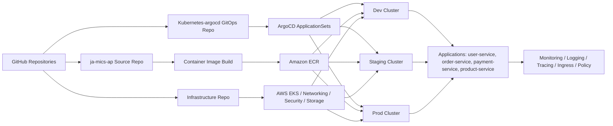

# Kubernetes ArgoCD Platform

<p align="center">
  <a href="https://github.com/Emmy-github-webdev/Kubernetes-argocd">
    
  </a>
  
  
  
  
</p>

A production-oriented GitOps control plane for deploying, governing, and operating the Ja-Mics application platform across multiple Kubernetes environments. This repository defines the ArgoCD application manifests, environment overlays, and platform services required to reconcile application workloads and shared infrastructure in a secure, repeatable, and auditable way.

This repo works in conjunction with:

- Application source code: [ja-mics-ap](https://github.com/Emmy-github-webdev/ja-mics-ap)
- Infrastructure repository: internal enterprise infrastructure platform (AWS/EKS and supporting cloud resources)
- This GitOps repository: [Kubernetes-argocd](https://github.com/Emmy-github-webdev/Kubernetes-argocd)

---

## Why this repository exists

This repository exists to provide a declarative, version-controlled delivery model for enterprise workloads. Instead of applying Kubernetes manifests manually, teams commit desired state into Git, and ArgoCD continuously reconciles the live cluster to match that state.

This approach improves:

- Deployment consistency across environments
- Auditability and change traceability
- Faster rollback and recovery
- Security and policy enforcement through Git-based review workflows
- Standardized platform operations for multiple services

The repository is designed for a multi-service architecture with shared platform components such as ingress, monitoring, logging, tracing, networking, storage, and security policy enforcement.

---

## Drawbacks and considerations

While GitOps is powerful, it is not without trade-offs:

- Requires strong Git and CI/CD governance to prevent drift or misconfiguration
- Cluster access and secrets management must be tightly controlled
- ArgoCD introduces another operational dependency in the platform stack
- Multi-environment drift can occur if overlays are not reviewed carefully
- Platform changes can affect many teams if shared components are modified broadly

These are manageable by using review policies, environment isolation, RBAC controls, and structured platform ownership.

---

## Architecture

The platform follows a GitOps-first operational model where application manifests and platform definitions are stored in Git and applied by ArgoCD to the target cluster.



### Repository layout

```text
Kubernetes-argocd/
├── apps/
│   ├── user-service/
│   ├── order-service/
│   ├── payment-service/
│   └── product-service/
├── argocd/
│   ├── dev/
│   ├── staging/
│   └── prod/
├── infrastructure/
├── platform/
│   ├── ingress/
│   ├── monitoring/
│   ├── logging/
│   ├── tracing/
│   ├── networking/
│   ├── security/
│   └── storage/
├── .github/
│   └── workflows/
├── README.md
└── LICENSE (if added for production compliance)
```

### Included platform capabilities

- Kubernetes application deployment via ArgoCD
- Multi-environment overlays for dev, staging, and prod
- Shared ingress and service exposure patterns
- Monitoring with Prometheus and Grafana
- Logging with Loki / Fluent Bit / Promtail
- Distributed tracing with Tempo and OpenTelemetry
- Policy enforcement with Kyverno
- Storage and CSI integrations for AWS-backed workloads
- Network security and ingress governance

---

## Project status

<p align="left">
  
  
  
  
</p>

- Build status: [GitHub Actions](https://github.com/Emmy-github-webdev/Kubernetes-argocd/actions)
- Coverage: tracked as part of the application CI and release pipeline in the application repository
- Deployment model: GitOps with ArgoCD and Kustomize-based overlays

---

## Quick start guide

### Prerequisites

Before deploying or modifying this platform, ensure you have the following:

- Access to an AWS EKS cluster or equivalent Kubernetes cluster
- ArgoCD installed and bootstrapped in the target cluster
- kubectl configured for cluster access
- GitHub access to the repository and deployment workflows
- AWS credentials with permissions to manage EKS and supporting resources
- A working understanding of Kubernetes, Kustomize, and GitOps workflow practices
- A running application image registry such as Amazon ECR

### Installation

1. Clone the repository:

```bash
git clone https://github.com/Emmy-github-webdev/Kubernetes-argocd.git
cd Kubernetes-argocd
```

2. Review the ArgoCD bootstrap definitions under the [argocd](argocd) folder.

3. Apply the root ArgoCD application for the target environment:

```bash
kubectl apply -f argocd/dev/root-app.yaml
```

4. Validate ArgoCD resources:

```bash
kubectl get applications -n argocd
kubectl get applicationsets -n argocd
```

5. Confirm the platform and application workloads are reconciled successfully.

---

## Basic usage examples

### Apply the development GitOps root

```bash
kubectl apply -f argocd/dev/root-app.yaml
```

### Inspect ArgoCD application state

```bash
kubectl get application -A
kubectl describe application dev-platform-root -n argocd
```

### Synced environment structure

This repository supports environment-specific application layering via overlays:

```bash
argocd/dev/
argocd/staging/
argocd/prod/
```

Each environment can reconcile different application versions, settings, and infrastructure constraints while preserving a common platform foundation.

---

## Architecture and deployment flow

The deployment flow is intentionally simple and enterprise-friendly:

1. Application source is maintained in the application repo.
2. Containers are built and pushed to the registry.
3. This GitOps repository declares the target state.
4. ArgoCD compares live cluster state with Git state.
5. Kubernetes resources are reconciled automatically.
6. Platform components and service workloads remain consistent across environments.

This repository is the control plane layer that connects application delivery to operational governance.

---

## Comprehensive documentation

For deeper implementation details, refer to the structured repository folders and environment manifests:

- [argocd](argocd)
- [apps](apps)
- [platform](platform)
- [infrastructure](infrastructure)
- [GitHub Actions workflow](.github/workflows/bootstrap-argocd.yml)

This repository is intentionally organized so platform engineers, DevOps teams, and application teams can work from a common system of record.

---

## Contributing guidelines

Contributions are welcome. To keep the platform stable, please follow these norms:

- Create feature branches from the main branch
- Keep changes scoped and environment-aware
- Validate YAML and Kustomize manifests before submission
- Use clear commit messages and meaningful PR descriptions
- Review security, networking, and observability impact before merging
- Ensure environment-specific changes are intentional and supported by the appropriate overlay

Please open a pull request against the main branch and include a concise summary of the operational impact.

---

## License

This repository currently does not include a public license file in the root directory. Before production release or external distribution, it is recommended to add an appropriate enterprise license such as MIT, Apache 2.0, or a company-specific policy.

If you are preparing for open-source publication, add a LICENSE file and update this section to match the selected license.

---

## Technologies used

- Kubernetes
- ArgoCD
- Kustomize
- GitHub Actions
- AWS EKS
- Prometheus
- Grafana
- Loki
- Tempo
- OpenTelemetry
- Kyverno
- NGINX Ingress / AWS load balancer patterns
- External Secrets / Secret Store integrations
- Docker / containerized microservices

---

## Repository links

- GitHub repository: [Kubernetes-argocd](https://github.com/Emmy-github-webdev/Kubernetes-argocd)
- GitHub Actions: [Workflow runs](https://github.com/Emmy-github-webdev/Kubernetes-argocd/actions)
- Application source repo: [ja-mics-ap](https://github.com/Emmy-github-webdev/ja-mics-ap)
- Infrastructure repo: enterprise internal infrastructure repository

---

## Summary

This repository is the GitOps backbone for an enterprise Kubernetes platform. It provides a secure, scalable, and auditable way to manage application delivery, platform components, and environment consistency across multiple deployments. The result is a modern operating model that fits the expectations of enterprise DevOps, platform engineering, and cloud-native delivery teams.
